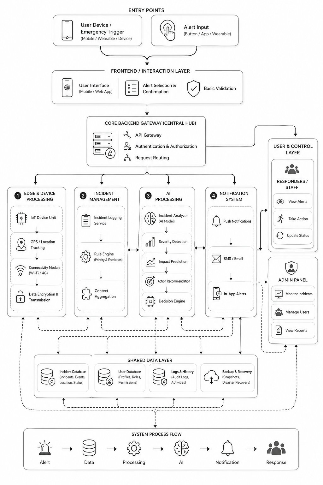

# Rapid Crisis Response MVP

Real-time emergency coordination platform for hospitality venues.

## Architecture
<p align="center">
  
</p>

## How It Works

A single button press triggers the entire pipeline in under 3 seconds — from emergency detection to AI-generated briefing, dynamic task allocation, and live staff coordination.

1. **Alert Triggered** — Staff or guest presses the IoT panic button (Medical / Fire / Security / Distress). A structured payload is instantly sent to the backend.
2. **Incident Logged** — The alert is validated and stored in Firestore with full context (type, room, device, timestamp).
3. **Gemini AI Activates** — Gemini analyses the incident and generates a 2-3 sentence situation brief + a dynamic action checklist tailored to the emergency type.
4. **Smart Task Allocation** — Based on available staff in the area, tasks from the checklist are dynamically assigned so every action has an owner and nothing falls through.
5. **Staff Notified Instantly** — FCM push notifications are fired to the right roles. The live dashboard updates in real time via Socket.IO.
6. **Acknowledge & Resolve** — Staff acknowledge and update status (Responding → Resolved) visible across all open dashboards simultaneously.
7. **Auto-Escalation** — If unacknowledged after 90 seconds, Gemini generates a contextual escalation message and alerts the manager.
8. **Risk Insights** — Every incident is logged. Vertex AI analyses 30 days of history to surface patterns and generate actionable risk reports.

## Tech Stack
| Layer | Technology |
|-------|-----------|
| Backend | FastAPI + Socket.IO |
| Database | Google Firestore |
| AI — Brief, Checklist & Task Allocation | Google Gemini API |
| AI — Analytics | Vertex AI |
| Notifications | Firebase Cloud Messaging |
| Frontend | React (Vite) + Axios |
| IoT Device | Custom 4-button panel (BLE + LoRaWAN) |

## Implemented Scope

- Panic-button ingestion endpoint: `POST /api/alert`
- Incident retrieval endpoint: `GET /api/alerts`
- Incident updates endpoint: `PATCH /api/alert/{id}`
- Real-time events: `new_alert` and `alert_updated`
- Gemini incident brief on every new alert (2-3 sentence summary + 3 actions)
- Dashboard with:
  - Active Alerts panel (color-coded by type)
  - Acknowledge button per card
  - Incident Log tab
  - Stats bar
  - Risk Insights tab with Gemini analysis over last 30 days

## Firestore Incident Shape

```json
{
  "id": "auto-doc-id",
  "type": "medical | fire | security | distress",
  "room": "401",
  "device_name": "panic_btn_401_a",
  "timestamp": "2026-04-26T10:45:00Z",
  "status": "active | responding | resolved",
  "gemini_brief": {
    "summary": "2-3 sentence situation brief",
    "recommended_actions": ["action 1", "action 2", "action 3"],
    "generated_at": "ISO timestamp",
    "model": "gemini model id"
  },
  "acknowledged_by": "Control Desk",
  "acknowledged_at": "ISO timestamp"
}
```

## Step-by-Step Run

### 1) Backend setup

```bash
cd backend
python -m venv .venv
source .venv/bin/activate
pip install -r requirements.txt
cp .env.example .env
# set GOOGLE_APPLICATION_CREDENTIALS and GOOGLE_API_KEY in .env
uvicorn app.main:app --reload --port 8000
```

### 2) Frontend setup

```bash
cd frontend
npm install
cp .env.example .env
npm run dev
```

### 3) Send a test alert

```bash
curl -X POST "http://localhost:8000/api/alert" \
  -H "Content-Type: application/json" \
  -d '{
    "type": "medical",
    "room": "401",
    "device_name": "panic_btn_401_a",
    "timestamp": "2026-04-26T10:45:00Z"
  }'
```

## Notes

- Teammate-owned features were intentionally excluded:
  - FCM push notifications
  - device registration endpoint
  - Gemini escalation timer
